<p align="center">
	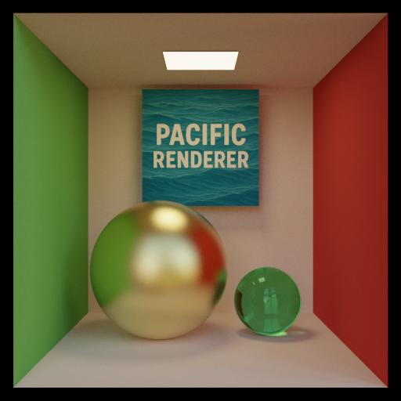
</p>

# PacificRenderer

PacificRenderer is a physically-based renderer written in C++. It aims to provide a flexible, extensible, and educational platform for photorealistic image synthesis, inspired by [Mitsuba](https://mitsuba-renderer.org/) and [PBRT](http://www.pbrt.org/). The renderer supports a subset of the Mitsuba scene file format, making it compatible with many Mitsuba scenes (with some limitations).

---

## Features

- **Physically-Based Rendering**: Implements unbiased Monte Carlo path tracing and other integrators for realistic image synthesis.
- **Mitsuba Scene Compatibility**: Supports a subset of Mitsuba's XML scene format, allowing you to use many existing Mitsuba scenes directly.
- **Modular Integrator System**: Includes integrators such as Path Tracer, Particle Tracer, Direct Lighting, Albedo, Depth, and more.
- **BSDFs and Materials**:
	- Diffuse
	- Conductor (Metal)
	- Dielectric (Glass)
	- Plastic
	- Thin Dielectric
	- Rough Conductor
	- Rough Dielectric
	- (RoughPlastic and some others are not yet implemented)
- **Light Sources**:
	- Point Light
	- Area Light
	- Directional Light
	- Environment Map (HDR)
- **Geometry**:
	- Triangle Meshes (obj, ply, serialized)
	- Spheres
	- Disks
    - Rectangle, Cube
- **Texture Support**: Bitmap, checkerboard, and constant textures.
- **Image Output**: Supports PNG, JPG, EXR, and HDR output formats.
- **Multithreading**: Parallel rendering using multiple CPU threads.
- **BVH Acceleration**: Fast ray tracing with bounding volume hierarchy.
- **Filter Support**: Gaussian reconstruction filter.
- **Extensible Registry System**: Easily add new BSDFs, integrators, emitters, and textures.

---

## Scene File Format & Compatibility

- Scene files are written in XML and are a subset of the [Mitsuba renderer's format](https://mitsuba.readthedocs.io/en/stable/src/key_topics/scene_format.html).
- Most Mitsuba scenes are compatible, but some features are not yet implemented (e.g., RoughPlastic BSDF and Volumetric Integrator).

---

## Building & Usage

1. **Clone the repository**
2. **Build with CMake**:
	 ```sh
	 mkdir build && cd build
	 cmake ..
	 cmake --build .
	 ```
3. **Run the renderer**:
	 ```sh
	 PacificRenderer path/to/scene.xml -o output.png --progress --threads 8
	 ```
	 - `-o`/`--output_file`: Output image path
	 - `-t`/`--threads`: Number of threads to use
	 - `-p`/`--progress`: Show progress bar

---

## Limitations & TODO

- Some Mitsuba features are not yet implemented (see `TODO.md` for details):
    - Bidirectional Path Tracing
    - Metropolis Light Transport
	- Volumetric Integrator
	- RoughPlastic BSDF
	- Disney Principled BSDF
	- UI for scene setup

---

## Gallery

Below are some images rendered with PacificRenderer. The scene files are mostly from [Mitsuba gallery](https://mitsuba.readthedocs.io/en/stable/src/gallery.html). Stanford bunny and dragon are from [Stanford 3D scanning repository](https://graphics.stanford.edu/data/3Dscanrep/).

### Cornell Box

| cornell-box | cbox-pacific | cbox-plastic |
|-------------|--------------|--------------|
| 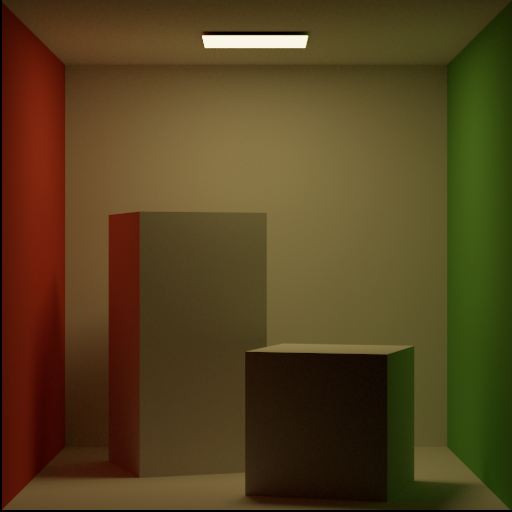 |  | 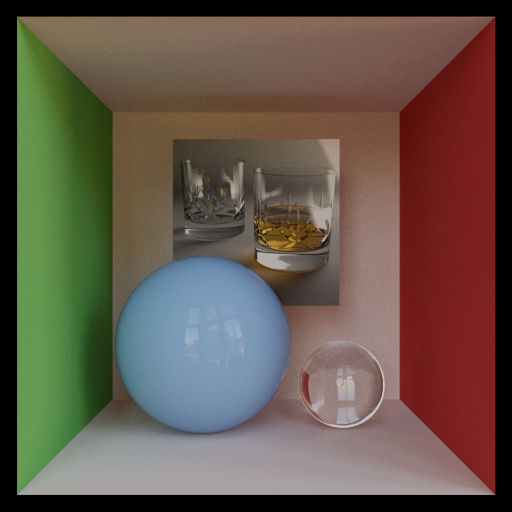 |

### MatPreview

| matpreview-conductor | matpreview-dielectric | matpreview-diffuse | matpreview-plastic |
|----------------------|----------------------|--------------------|--------------------|
| 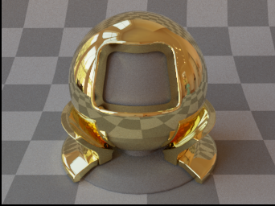 | 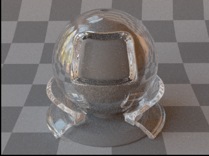 | 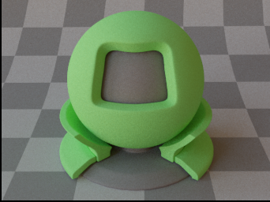 | 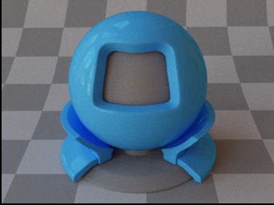 |

| matpreview-roughconductor | matpreview-roughdielectric | thindielectric |
|--------------------------|----------------------------|----------------|
| 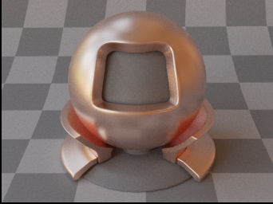 | 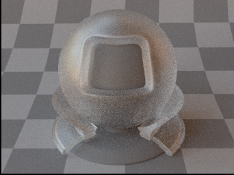 | 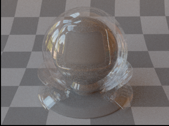 |

### Cars

| car | car2 |
|-----|------|
| 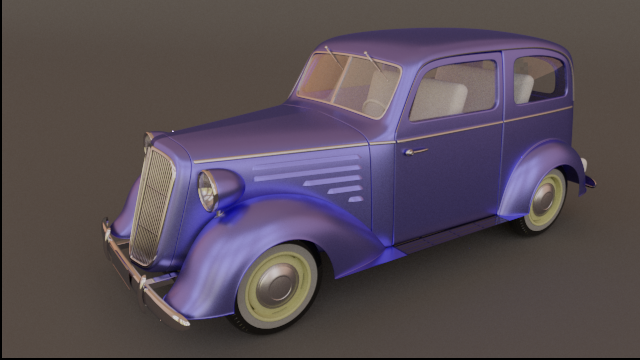 | 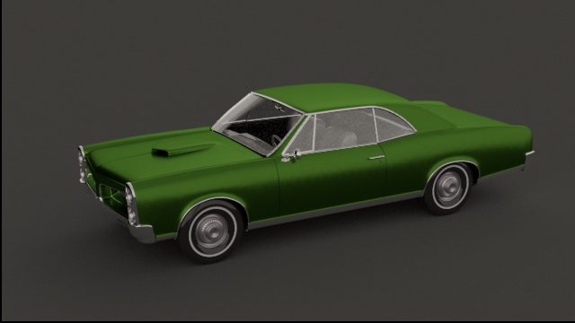 |

### Veach Scenes

| veach-ajar | veach-bidir | veach-mis |
|------------|------------|-----------|
| 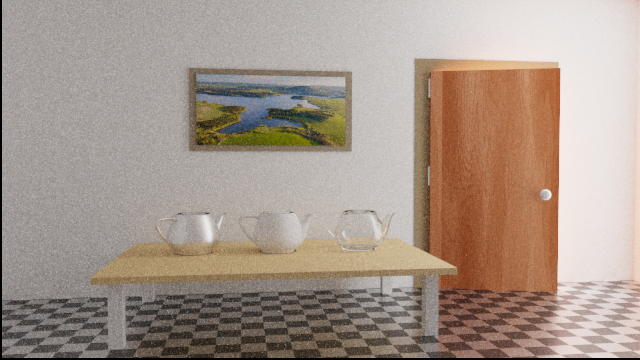 | 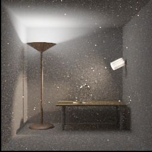 | 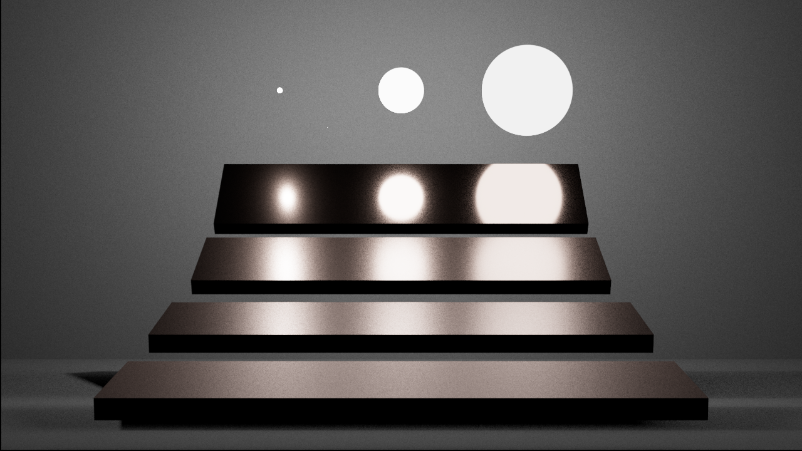 |

### Misc.

| glass-of-water | lamp | lego-bulldozer | stanford-bunny-dielectric |
|----------------|------|---------------|---------------------------|
| 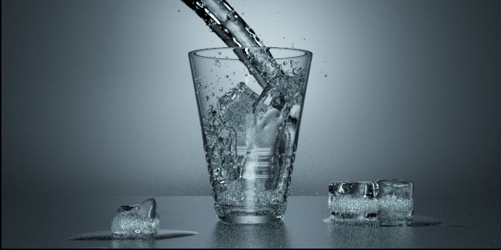 | 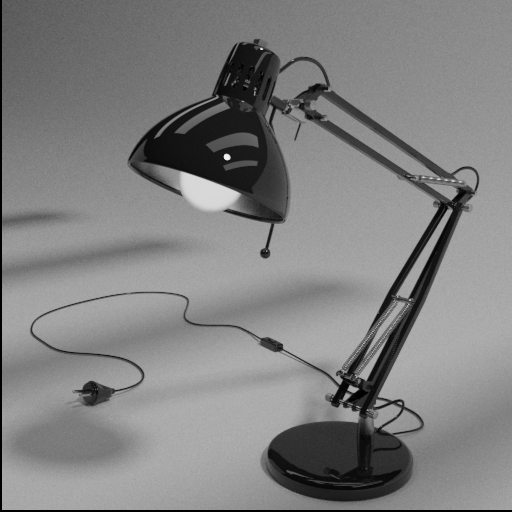 | 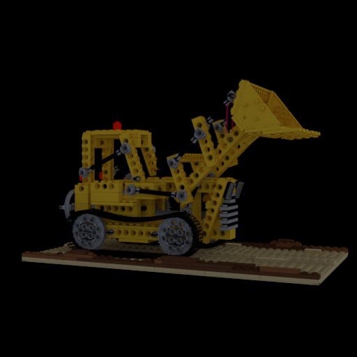 | 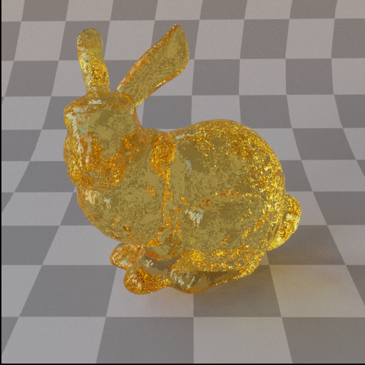 |

| stanford-bunny-diffuse | stanford-dragon | teapot |
|-----------------------|-----------------|--------|
| 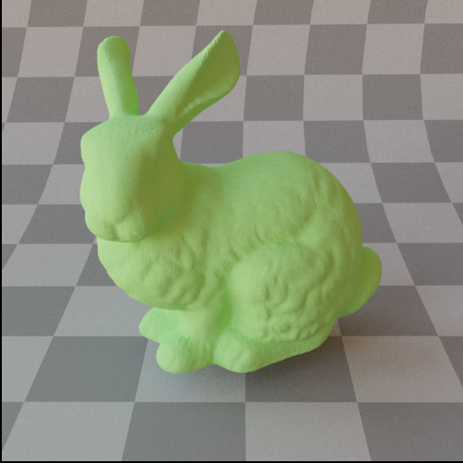 | 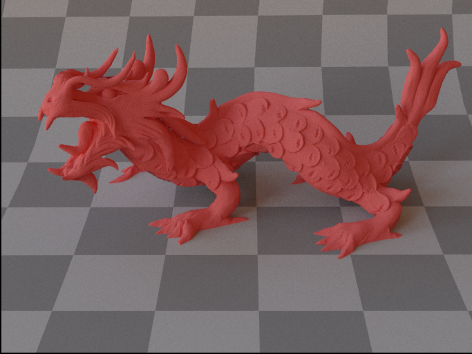 | 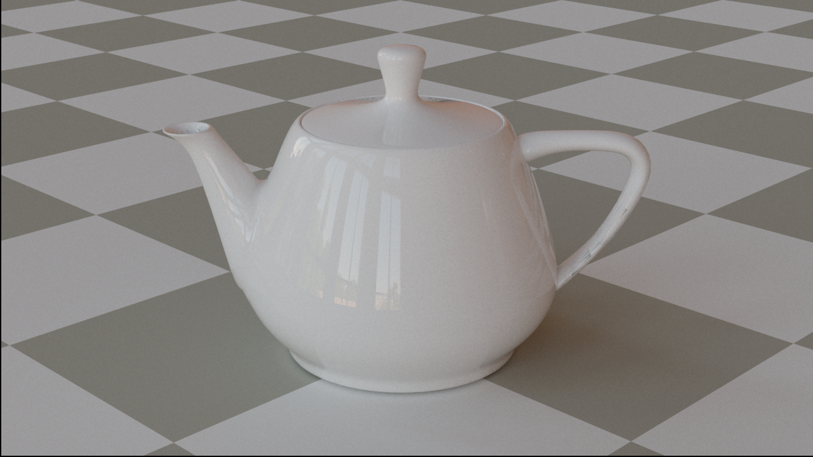 |

---

## License

PacificRenderer is open source and distributed under the MIT License.

---

## Acknowledgements

- Mitsuba Renderer
- PBRT
- OpenEXR, stb, pugixml, tinyobjloader, and other open-source libraries
- See `ext/` for third-party library licenses

---

For more information, see the code and comments, or open an issue!
